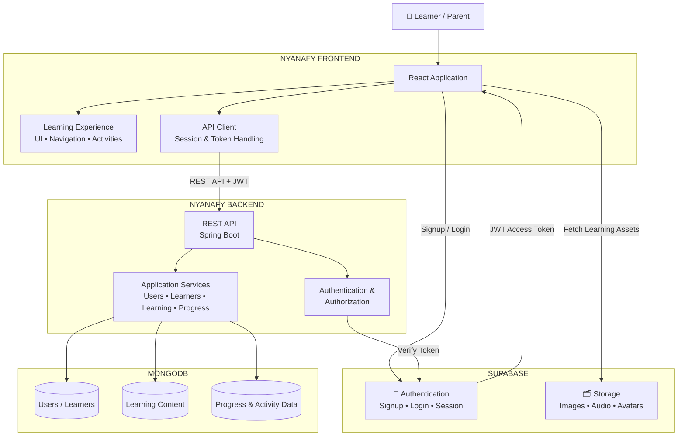

# Nyanafy — High Level Architecture
 
## Overview
 
Nyanafy follows a three-tier architecture — a React web frontend, a Spring Boot REST API, and a data layer split between MongoDB Atlas (application data) and Supabase (authentication and file storage). All communication between tiers is JWT-secured using ES256 tokens issued by Supabase Auth and validated by Spring Boot's OAuth2 resource server.
 
---
 
## Architecture Diagram


---

---
 
## Layer Breakdown
 
### Frontend — React.js + TanStack Query
The React web application serves as the primary interface for both parents and children. TanStack Query manages all server state with intelligent caching — data is only re-fetched when something meaningful changes (activity completed, level finished), not on every screen navigation. This is particularly important for kids switching between screens repeatedly on slow mobile connections.
 
### Backend — Spring Boot 4 (Java 21)
The Spring Boot REST API acts as the orchestration layer between the frontend and the data layer. It handles business logic, aggregates data from multiple MongoDB collections into single page-level responses, validates Supabase JWT tokens on every protected request, and resolves Supabase Storage keys into full CDN URLs before returning content to the frontend.
 
### Data Layer — MongoDB Atlas
MongoDB stores all application data — user profiles, child profiles, learning content (worlds, paths, levels, activities, assets), and learner progress. The flexible document schema allows new content to be added without schema migrations or code changes. Progress is tracked across three independent collections to support concurrent learning across multiple paths and worlds.
 
### Identity — Supabase Auth
Supabase handles all authentication concerns — parent registration, login, password reset, and JWT issuance. Spring Boot never manages passwords or sessions directly. On login, Supabase issues a signed JWT (ES256) which React attaches to every API request via an Axios interceptor. Spring Boot validates this token against Supabase's public JWKS endpoint.
 
### File Storage — Supabase Storage
All binary assets — SVG illustrations and Kannada audio files — are stored in Supabase Storage and served via CDN. MongoDB stores only the storage key (file path). The Spring Boot API resolves keys to full CDN URLs before returning responses to React, keeping the storage implementation detail hidden from the frontend.
 
---
 
## Key Flows
 
### Authentication Flow
```
Parent opens app
  → enters email + password
  → React calls Supabase Auth directly
  → Supabase returns JWT (ES256) + session
  → React stores session (Supabase client handles this)
  → Axios interceptor attaches JWT to all subsequent API calls
  → Spring Boot validates JWT on every protected request
  → supabaseUserId extracted from JWT "sub" claim
  → MongoDB user document located by supabaseUserId
```
 
### Content Delivery Flow
```
Child enters a level
  → React calls GET /api/engine/level/{levelId} (aggregation API)
  → Spring Boot queries MongoDB:
      - level document
      - activity documents
      - learning asset documents
  → Storage keys resolved to full Supabase CDN URLs
  → Single aggregated response returned to React
  → React renders letter, images, audio — all from one API call
```
 
### Progress Saving Flow
```
Child completes an activity
  → XP added locally in React state (no API call yet)
  → Child completes ALL activities in level
  → Child taps "Finish Level"
  → React calls POST /api/progress/complete-level
  → Spring Boot updates three collections atomically:
      - learner_level_progress → level marked COMPLETED
      - learner_path_progress  → level added to completedLevelIds
      - learner_progress       → XP incremented, level count updated
  → TanStack Query invalidates path and dashboard cache
  → Path page re-fetches → next level unlocked in UI
```
 
---
 
## Security Model
 
```
Public endpoints (no token required):
  → GET /api/learning-assets/**   (content loading in React)
  → GET /api/worlds/**            (world map loading)
  → /api/auth/**                  (signup, login)
  → /swagger-ui/**                (API documentation)
 
Authenticated endpoints (valid Supabase JWT required):
  → All user, progress, and profile endpoints
 
Admin only (valid JWT + admin role in app_metadata):
  → POST/PUT/DELETE on content endpoints
    (adding worlds, levels, assets — only accessible to platform admin)
```
 
---
 
## Infrastructure
 
```
Frontend  →  Vercel       (React deployment, global CDN)
Backend   →  Railway      (Spring Boot deployment)
Database  →  MongoDB Atlas (AWS — US East Virginia, free tier M0)
Auth      →  Supabase     (managed auth service)
Storage   →  Supabase     (CDN-backed file storage)

---
 
*For technology selection rationale see [Key Architectural Decisions](../README.md#key-architectural-decisions)*
