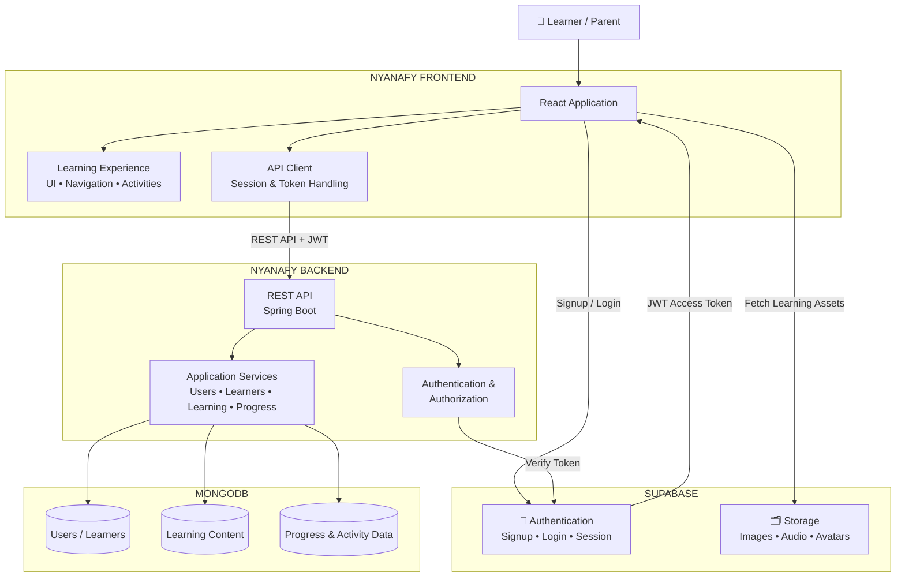

```mermaid

flowchart TB
    %% =========================
    %% Client
    %% =========================
    USER["👤 Learner / Parent"]

    subgraph FRONTEND["NYANAFY FRONTEND"]
        REACT["React Application"]
        UI["Learning Experience<br/>UI • Navigation • Activities"]
        CLIENT["API Client<br/>Session & Token Handling"]
        
        REACT --> UI
        REACT --> CLIENT
    end

    %% =========================
    %% Supabase
    %% =========================
    subgraph SUPABASE["SUPABASE"]
        AUTH["🔐 Authentication<br/>Signup • Login • Session"]
        STORAGE["🗂️ Storage<br/>Images • Audio • Avatars"]
    end

    %% =========================
    %% Backend
    %% =========================
    subgraph BACKEND["NYANAFY BACKEND"]
        API["REST API<br/>Spring Boot"]
        
        SECURITY["Authentication &<br/>Authorization"]
        SERVICES["Application Services<br/>Users • Learners • Learning • Progress"]
        
        API --> SECURITY
        API --> SERVICES
    end

    %% =========================
    %% Database
    %% =========================
    subgraph DATABASE["MONGODB"]
        USERS[("Users / Learners")]
        LEARNING[("Learning Content")]
        PROGRESS[("Progress & Activity Data")]
    end

    %% =========================
    %% Authentication flow
    %% =========================
    USER --> REACT

    REACT -->|"Signup / Login"| AUTH
    AUTH -->|"JWT Access Token"| REACT

    %% =========================
    %% Application data flow
    %% =========================
    CLIENT -->|"REST API + JWT"| API
    SECURITY -->|"Verify Token"| AUTH

    SERVICES --> USERS
    SERVICES --> LEARNING
    SERVICES --> PROGRESS

    %% =========================
    %% Assets
    %% =========================
    REACT -->|"Fetch Learning Assets"| STORAGE
```
